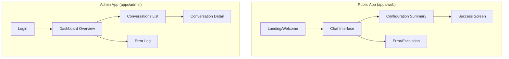
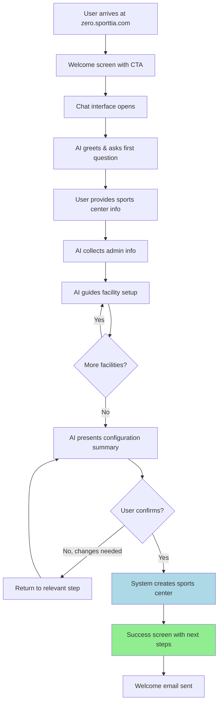
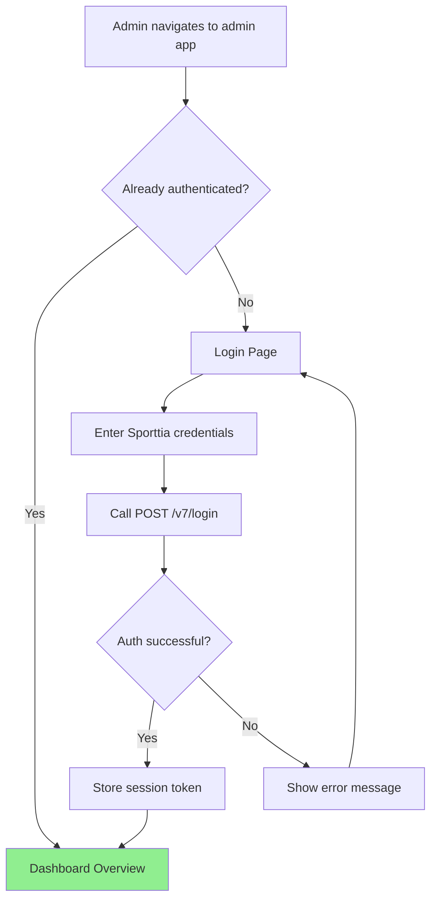
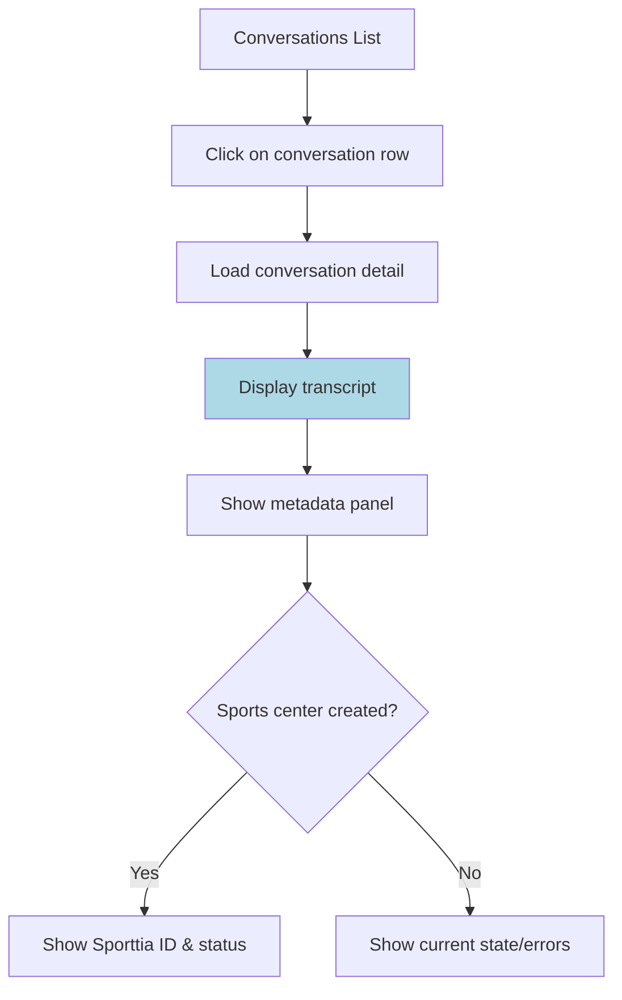

# Sporttia ZERO UI/UX Specification

This document defines the user experience goals, information architecture, user flows, and visual design specifications for Sporttia ZERO's user interface. It serves as the foundation for visual design and frontend development, ensuring a cohesive and user-centered experience.

## Change Log

| Date | Version | Description | Author |
|------|---------|-------------|--------|
| 2026-01-16 | 0.2 | Updated design with two-column layout and info sidebar | BMad Master |
| 2026-01-16 | 0.1 | Initial UI/UX specification | BMad Master |

---

## 1. Overall UX Goals & Principles

### 1.1 Target User Personas

**Primary Persona: Sports Center Owner ("Carlos")**
- **Demographics:** Age 35-55, small business owner, manages 1-3 facilities
- **Tech comfort:** Moderate - uses WhatsApp, basic apps, but not a power user
- **Context:** Busy, often on mobile, wearing multiple hats (operations, marketing, customer service)
- **Goals:** Get online quickly, look professional, reduce admin overhead
- **Pain points:** Fears complexity, limited time, skeptical of long setup processes
- **Quote:** "I just want to get my padel courts online without spending days figuring it out."

**Secondary Persona: Admin/Operations ("Maria")**
- **Demographics:** Age 25-40, Sporttia internal staff
- **Tech comfort:** High - comfortable with dashboards, data analysis
- **Context:** Desktop-first, monitoring multiple metrics
- **Goals:** Monitor conversion funnel, debug issues, understand user behavior
- **Pain points:** Needs quick access to data, dislikes switching between tools
- **Quote:** "I need to see at a glance if something's broken and drill into the details fast."

### 1.2 Usability Goals

| Goal | Target | Measurement |
|------|--------|-------------|
| **Ease of learning** | New users complete signup in first attempt | >80% completion without help |
| **Time to value** | Conversation to sports center created | <10 minutes average |
| **Error recovery** | Users can correct mistakes easily | Zero dead-ends in conversation |
| **Confidence** | Users feel certain before committing | 100% see confirmation before creation |
| **Accessibility** | All users can complete core tasks | WCAG AA compliance |

### 1.3 Design Principles

1. **Conversational, not transactional** - The chat should feel like talking to a helpful expert, not filling out a form in disguise. Natural language, personality, encouragement.

2. **Progressive disclosure** - Don't overwhelm. Collect information step by step. Only show what's needed at each moment.

3. **Confidence through confirmation** - Before any irreversible action, show exactly what will happen. Let users review and correct.

4. **Instant feedback** - Every action gets a response. Typing indicators, delivery confirmations, progress signals.

5. **Mobile-first, desktop-ready** - Design for the phone in someone's hand, scale up gracefully for desktop.

---

## 2. Information Architecture

### 2.1 Site Map / Screen Inventory



### 2.2 Navigation Structure

**Public Chat App:**
- **No traditional navigation** - Single-page flow driven by conversation
- **Implicit progression:** Welcome → Chat → Summary → Success
- **Exit points:** Browser back (abandon), email link (escalation)

**Admin Dashboard:**
- **Primary Navigation (Sidebar):**
  - Dashboard (metrics overview)
  - Conversations (list view)
  - Errors (error log)
- **Secondary Navigation:**
  - User menu (logout)
- **Breadcrumbs:** Dashboard > Conversations > [Conversation ID]

---

## 3. User Flows

### 3.1 Flow: New Sports Center Onboarding (Primary)

**User Goal:** Create a new sports center on Sporttia through conversation

**Entry Points:**
- Direct URL (zero.sporttia.com)
- Marketing campaigns
- Referral links

**Success Criteria:**
- Sports center created in Sporttia
- Welcome email received
- User knows next steps



**Edge Cases & Error Handling:**
- **AI doesn't understand:** Rephrases question, offers examples, eventually escalates to sales@sporttia.com
- **API failure during creation:** Shows friendly error, offers retry, provides sales email
- **User abandons mid-conversation:** Session lost (no recovery per requirements)
- **Invalid email format:** AI asks for correction before proceeding
- **Network interruption:** Frontend shows reconnection attempt, preserves message history

**Notes:** The conversation flow should feel natural, not like a wizard. AI should acknowledge and encourage throughout.

---

### 3.2 Flow: Admin Login & Dashboard Access

**User Goal:** Access the admin dashboard to monitor conversations

**Entry Points:** admin.zero.sporttia.com (or /admin route)

**Success Criteria:** Authenticated admin sees dashboard metrics



**Edge Cases:**
- **Invalid credentials:** Clear error message, allow retry
- **Session expired:** Redirect to login with "session expired" message
- **Non-admin user:** API rejects, show "unauthorized" message

---

### 3.3 Flow: Admin Reviews Conversation

**User Goal:** View details and transcript of a specific conversation

**Entry Points:** Click from conversations list, direct link with conversation ID

**Success Criteria:** Full transcript visible with metadata



---

## 4. Wireframes & Key Screens

### 4.1 Design Files

**Primary Design Tool:** TBD (Figma recommended)

> Note: Detailed visual designs should be created in Figma. The following are conceptual layouts to guide design.

### 4.2 Key Screen Layouts

#### Screen: Chat Interface (Public - Two-Column Desktop Layout)

**Purpose:** Primary interaction point where users converse with AI to create their sports center

**Key Elements:**

**Left Panel (Chat):**
- Lime green header bar with "Sporttia ZERO" title in white
- Message history area (scrollable, white background)
- Assistant messages: left-aligned, light gray bubble with lightning bolt icon
- User messages: right-aligned (minimal styling, text only or light bubble)
- Typing indicator (animated dots when AI is "thinking")
- Input area at bottom: rounded text field with green circular send button (paper plane icon)
- Chat panel has subtle shadow/rounded corners

**Right Panel (Info Sidebar - Desktop only):**
- Three info cards with icons and helpful information:
  1. **Info Card** (ℹ️ icon): "This assistant allows you to create a basic sports center. Keep in mind that Sporttia has many more modules to manage members, card payments, activities, tournaments, etc."
  2. **Sales Contact Card** (👤 icon): "If you prefer to contact a sales representative, you can write to us at sales@sporttia.com."
  3. **Feedback Card** (✉️ icon): "If you want to leave feedback about this assistant, please write to us at zero@sporttia.com."
- Cards have white background, rounded corners, subtle shadow
- Email addresses are clickable links in primary green color

**Background:**
- Light blue-gray gradient background
- Subtle decorative sports-related shapes (balls, abstract curves) in light green/transparent overlay

**Interaction Notes:**
- On page load, detect browser language via `navigator.language` and create conversation with that language
- Input field auto-focuses on load
- Send via Enter key or tap send button
- Auto-scroll to newest message
- Pull-to-refresh disabled (real-time updates)
- Keyboard pushes content up (mobile)
- On mobile: info sidebar hidden, full-width chat

**Layout (Desktop - Two Column):**
```
┌────────────────────────────────────────────────────────────────────────────┐
│                    Background with decorative elements                      │
│  ┌─────────────────────────────────┐  ┌──────────────────────────────────┐ │
│  │ ██████ Sporttia ZERO ██████████ │  │ ℹ️ This assistant allows you to  │ │
│  │ (Green header bar)              │  │    create a basic sports center. │ │
│  ├─────────────────────────────────┤  │    Keep in mind that Sporttia... │ │
│  │                                 │  └──────────────────────────────────┘ │
│  │  ┌─────────────────────────┐    │                                       │
│  │  │ Hello! I'm your         │    │  ┌──────────────────────────────────┐ │
│  │  │ Sporttia assistant...   │    │  │ 👤 If you prefer to contact a    │ │
│  │⚡└─────────────────────────┘    │  │    sales representative, write   │ │
│  │                                 │  │    to sales@sporttia.com         │ │
│  │                                 │  └──────────────────────────────────┘ │
│  │                                 │                                       │
│  │                                 │  ┌──────────────────────────────────┐ │
│  │                                 │  │ ✉️ If you want to leave feedback │ │
│  │                                 │  │    please write to us at         │ │
│  │                                 │  │    zero@sporttia.com             │ │
│  │                                 │  └──────────────────────────────────┘ │
│  ├─────────────────────────────────┤                                       │
│  │ ┌─────────────────────────┐ 🟢  │                                       │
│  │ │ Type your message...    │ ➤   │                                       │
│  │ └─────────────────────────┘     │                                       │
│  └─────────────────────────────────┘                                       │
└────────────────────────────────────────────────────────────────────────────┘
```

**Layout (Mobile - Single Column):**
```
┌─────────────────────────┐
│ ██ Sporttia ZERO ██████ │ <- Green header
├─────────────────────────┤
│                         │
│  ┌─────────────┐        │
│⚡│ AI message  │        │ <- Lightning icon
│  └─────────────┘        │
│                         │
│        ┌─────────────┐  │
│        │ User msg    │  │ <- Right aligned
│        └─────────────┘  │
│                         │
│  ┌─────────────┐        │
│  │ AI typing...│        │
│  └─────────────┘        │
│                         │
├─────────────────────────┤
│ ┌───────────────────┐🟢 │
│ │Type your message..│➤  │ <- Rounded input + green send
│ └───────────────────┘   │
└─────────────────────────┘
```

---

#### Screen: Configuration Summary (Public)

**Purpose:** Show user complete sports center configuration before final creation

**Key Elements:**
- Clear heading ("Review Your Sports Center")
- Organized sections: Center Info, Admin, Facilities
- Each facility shows name, sport, schedule summary
- Edit buttons/links to modify sections (triggers AI conversation)
- Prominent "Confirm & Create" button
- Secondary "I need to change something" option

**Interaction Notes:**
- Can be rendered inline in chat or as modal/overlay
- Scrollable if many facilities
- Confirm button requires explicit tap (no auto-submit)

**Layout:**
```
┌─────────────────────────┐
│ Review Your Sports Center│
├─────────────────────────┤
│ CENTRO DEPORTIVO        │
│ Name: Club Padel Madrid │
│ City: Madrid            │
│ Language: Spanish (es)  │
│                    [Edit]│
├─────────────────────────┤
│ ADMINISTRATOR           │
│ Name: Carlos García     │
│ Email: carlos@email.com │
│                    [Edit]│
├─────────────────────────┤
│ FACILITIES              │
│ ┌─────────────────────┐ │
│ │ Pista 1 - Padel     │ │
│ │ Mon-Fri 9:00-21:00  │ │
│ │ 30min slots, €12    │ │
│ └─────────────────────┘ │
│ ┌─────────────────────┐ │
│ │ Pista 2 - Padel     │ │
│ │ Mon-Sun 8:00-22:00  │ │
│ │ 60min slots, €20    │ │
│ └─────────────────────┘ │
│                    [Edit]│
├─────────────────────────┤
│ [✓ Confirm & Create]    │
│ [← I need to change...] │
└─────────────────────────┘
```

---

#### Screen: Success Screen (Public)

**Purpose:** Confirm sports center creation and provide next steps

**Key Elements:**
- Success icon/animation (checkmark, celebration)
- Clear confirmation message
- Sports center name displayed
- "Check your email" instruction
- Link to Sporttia Manager login
- Optional: Share/social buttons

**Interaction Notes:**
- Auto-triggered after successful API response
- Email should arrive within seconds
- No back button needed (journey complete)

---

#### Screen: Dashboard Overview (Admin)

**Purpose:** At-a-glance metrics for operations team

**Key Elements:**
- Metric cards: Total conversations, Completion rate, Active now, Errors
- Trend indicators (vs. previous period)
- Conversion funnel visualization
- Recent activity feed or quick links
- Date range filter

**Layout (Desktop):**
```
┌──────────────────────────────────────────────────┐
│ [☰] Sporttia ZERO Admin          [Maria ▼]      │
├────────┬─────────────────────────────────────────┤
│        │                                         │
│ 📊     │  Today's Metrics                        │
│ Dash   │  ┌──────┐ ┌──────┐ ┌──────┐ ┌──────┐   │
│        │  │  47  │ │  68% │ │   3  │ │   2  │   │
│ 💬     │  │Convos│ │Compl.│ │Active│ │Errors│   │
│ Convos │  └──────┘ └──────┘ └──────┘ └──────┘   │
│        │                                         │
│ ⚠️     │  Conversion Funnel                      │
│ Errors │  [=============================] 100%   │
│        │  [===================        ]  68%    │
│        │  [================           ]  54%    │
│        │  Started → Email → Completed           │
│        │                                         │
└────────┴─────────────────────────────────────────┘
```

---

#### Screen: Conversations List (Admin)

**Purpose:** Browse and search all conversations

**Key Elements:**
- Data table with columns: ID, Language, Status, Created, Admin Email
- Status badges (color-coded)
- Filters: Status, Date range
- Search box
- Pagination controls
- Click row to view detail

**Interaction Notes:**
- Default sort: newest first
- Clicking row navigates to detail view
- Filters apply immediately (no submit button)

---

#### Screen: Conversation Detail (Admin)

**Purpose:** View full conversation transcript and metadata

**Key Elements:**
- Back button to list
- Metadata panel (status, language, timestamps, session ID)
- Transcript in chat format (same visual style as user sees)
- Collected data summary (expandable)
- Sports center result (if created)
- Error details (if any)
- Copy conversation ID button

---

## 5. Component Library / Design System

### 5.1 Design System Approach

**Approach:** Build on existing component library (TBD - shadcn/ui, Radix, or custom) with Sporttia brand customization.

**Recommendation:** Use **shadcn/ui** for rapid development with full customization control, styled with Sporttia colors.

### 5.2 Core Components

#### Component: ChatMessage

**Purpose:** Display a single message in the conversation

**Variants:**
- `user` - Right-aligned, minimal styling or light background
- `assistant` - Left-aligned, light gray bubble (`#F5F5F5`), includes lightning bolt icon (⚡) in primary green color positioned to the left of the bubble
- `system` - Center-aligned, subtle styling (for errors/notices)

**Visual Specifications:**
- Assistant bubble: Light gray background, rounded corners (12px), subtle shadow
- Lightning icon: Primary green (`#9ACD32`), positioned bottom-left of bubble, slight overlap
- User bubble: Minimal or white with subtle border
- Max width: 80% of chat container

**States:** Default, Loading (skeleton), Error

**Usage Guidelines:** Always include timestamp (hover or visible). User messages show checkmark when delivered.

---

#### Component: ChatInput

**Purpose:** Text input for user messages

**Variants:**
- `default` - Standard input with send button
- `disabled` - While AI is responding

**Visual Specifications:**
- Input field: White background, rounded corners (24px full pill shape), subtle border
- Send button: Circular, primary green (`#9ACD32`) background, white paper plane icon
- Container: Slight padding, positioned at bottom of chat panel

**States:** Empty, Has text, Disabled, Focused

**Usage Guidelines:** Send button only enabled when text present. Supports Enter to send, Shift+Enter for newline.

---

#### Component: InfoCard

**Purpose:** Display helpful information in the right sidebar (desktop only)

**Variants:**
- `info` - General information (ℹ️ info circle icon)
- `sales` - Sales contact information (👤 person icon)
- `feedback` - Feedback contact information (✉️ email icon)

**Visual Specifications:**
- Background: White (`#FFFFFF`)
- Border radius: 12px
- Shadow: Subtle drop shadow (`0 2px 8px rgba(0,0,0,0.08)`)
- Padding: 16px 20px
- Icon: Left-aligned, primary green color (`#9ACD32`), 24px size
- Text: Dark gray (`#1A202C`), 14px body text
- Links: Primary green color, underline on hover

**Content:**
1. **Info Card:** "This assistant allows you to create a basic sports center. Keep in mind that Sporttia has many more modules to manage members, card payments, activities, tournaments, etc."
2. **Sales Card:** "If you prefer to contact a sales representative, you can write to us at [sales@sporttia.com](mailto:sales@sporttia.com)."
3. **Feedback Card:** "If you want to leave feedback about this assistant, please write to us at [zero@sporttia.com](mailto:zero@sporttia.com)."

**States:** Default only (static content)

**Usage Guidelines:** Only visible on desktop (≥1024px). Hidden on mobile/tablet. Cards are stacked vertically with 16px gap.

---

#### Component: ChatHeader

**Purpose:** Display the header bar at the top of the chat panel

**Visual Specifications:**
- Background: Primary green (`#9ACD32`)
- Height: 56px
- Title: "Sporttia ZERO" in white, bold, 18px
- Border radius: Top corners 12px (to match chat panel)
- Full width of chat panel

**States:** Default only (static)

**Usage Guidelines:** Always visible. No interactive elements in MVP.

---

#### Component: DecorativeBackground

**Purpose:** Provide visual interest and brand identity to the page background

**Visual Specifications:**
- Base: Linear gradient from light blue-gray (`#E8F4FC`)
- Decorative elements: Abstract sports-related shapes (tennis balls, curved lines, circular patterns)
- Colors: Very light green/transparent (`rgba(154, 205, 50, 0.1)` to `rgba(154, 205, 50, 0.2)`)
- Positioning: Fixed background, elements scattered in corners and edges
- Elements should be subtle and not distract from main content

**States:** Default only (static, decorative)

**Usage Guidelines:**
- Purely decorative, no semantic meaning
- Should use CSS background or SVG, not images for performance
- Reduced motion: Static, no animation
- Elements positioned to frame content without overlapping interactive areas

---

#### Component: TypingIndicator

**Purpose:** Show that AI is preparing a response

**Variants:** Standard (three dots animation)

**States:** Visible, Hidden

**Usage Guidelines:** Show immediately when user sends message, hide when AI response arrives.

---

#### Component: StatusBadge

**Purpose:** Display conversation status in admin views

**Variants:**
- `active` - Blue
- `completed` - Green
- `abandoned` - Gray
- `error` - Red

**States:** Default only

**Usage Guidelines:** Always use consistent colors across all admin views.

---

#### Component: MetricCard

**Purpose:** Display a single KPI on the dashboard

**Variants:**
- `default` - Number + label
- `with-trend` - Includes up/down arrow and percentage

**States:** Default, Loading (skeleton)

**Usage Guidelines:** Use consistent sizing. Trend colors: green for positive, red for negative.

---

#### Component: DataTable

**Purpose:** Display tabular data (conversations, errors)

**Variants:**
- `default` - Standard table
- `clickable-rows` - Rows are interactive

**States:** Default, Loading, Empty, Error

**Usage Guidelines:** Always include pagination for >20 items. Support column sorting where relevant.

---

## 6. Branding & Style Guide

### 6.1 Visual Identity

**Brand Guidelines:** Align with Sporttia main brand (sporttia.com)

> Note: Specific brand assets should be obtained from Sporttia brand team.

### 6.2 Color Palette

| Color Type | Hex Code | Usage |
|------------|----------|-------|
| Primary | `#9ACD32` (Sporttia Lime Green) | Header background, buttons, icons, links |
| Primary Light | `#B8E065` | Hover states, accents |
| Primary Dark | `#7CB028` | Active states, emphasis |
| Secondary | `#4A5568` (Dark Gray) | Text emphasis, secondary text |
| Background | `#E8F4FC` | Page background (light blue-gray gradient) |
| Background Gradient | `linear-gradient(135deg, #E8F4FC 0%, #F0F7FC 50%, #E8F4FC 100%)` | Main page background |
| Card Background | `#FFFFFF` | Chat panel, info cards |
| Message User | `#9ACD32` | User message bubbles (optional) |
| Message Assistant | `#F5F5F5` | Assistant message bubbles |
| Success | `#22C55E` | Positive feedback, confirmations |
| Warning | `#F59E0B` | Cautions, important notices |
| Error | `#EF4444` | Errors, destructive actions |
| Neutral 100 | `#F8FAFC` | Light backgrounds |
| Neutral 200 | `#E2E8F0` | Borders, dividers |
| Neutral 500 | `#64748B` | Secondary text, muted content |
| Neutral 900 | `#1A202C` | Primary text |

### 6.3 Typography

**Font Families:**
- **Primary:** Inter (or Sporttia brand font)
- **Secondary:** System font stack (fallback)
- **Monospace:** JetBrains Mono (code, IDs)

**Type Scale:**

| Element | Size | Weight | Line Height |
|---------|------|--------|-------------|
| H1 | 32px / 2rem | 700 | 1.2 |
| H2 | 24px / 1.5rem | 600 | 1.3 |
| H3 | 20px / 1.25rem | 600 | 1.4 |
| Body | 16px / 1rem | 400 | 1.5 |
| Small | 14px / 0.875rem | 400 | 1.5 |
| Caption | 12px / 0.75rem | 400 | 1.4 |

### 6.4 Iconography

**Icon Library:** Lucide Icons (recommended) - clean, consistent, MIT licensed

**Usage Guidelines:**
- Use outlined style for navigation and actions
- Use filled style for status indicators
- Consistent 24px size for touch targets
- Always pair icons with text labels in navigation

### 6.5 Spacing & Layout

**Grid System:**
- 12-column grid for desktop admin
- Single column for mobile chat

**Spacing Scale (8px base):**
- `xs`: 4px
- `sm`: 8px
- `md`: 16px
- `lg`: 24px
- `xl`: 32px
- `2xl`: 48px
- `3xl`: 64px

---

## 7. Accessibility Requirements

### 7.1 Compliance Target

**Standard:** WCAG 2.1 AA

### 7.2 Key Requirements

**Visual:**
- Color contrast ratios: Minimum 4.5:1 for normal text, 3:1 for large text
- Focus indicators: Visible 2px outline on all interactive elements
- Text sizing: Support browser zoom to 200% without content loss

**Interaction:**
- Keyboard navigation: All features accessible via keyboard alone
- Screen reader support: Proper ARIA labels, live regions for chat updates
- Touch targets: Minimum 44x44px for all interactive elements

**Content:**
- Alternative text: Decorative images hidden, informative images described
- Heading structure: Logical hierarchy (H1 → H2 → H3), no skipped levels
- Form labels: All inputs have visible labels or proper aria-label

### 7.3 Testing Strategy

- Automated: axe-core in CI/CD pipeline
- Manual: Keyboard-only navigation testing
- Screen reader: VoiceOver (Mac), NVDA (Windows)
- Color: Sim Daltonism for colorblind simulation

---

## 8. Responsiveness Strategy

### 8.1 Breakpoints

| Breakpoint | Min Width | Max Width | Target Devices |
|------------|-----------|-----------|----------------|
| Mobile | 0px | 639px | Phones |
| Tablet | 640px | 1023px | Tablets, small laptops |
| Desktop | 1024px | 1279px | Laptops, monitors |
| Wide | 1280px | - | Large monitors |

### 8.2 Adaptation Patterns

**Layout Changes:**
- Chat (Desktop ≥1024px): Two-column layout - chat panel (60%) on left, info sidebar (40%) on right
- Chat (Tablet/Mobile <1024px): Single column, chat only, info sidebar hidden
- Chat panel: Max-width 600px, centered within its column
- Info sidebar: Max-width 400px, stacked cards
- Admin: Sidebar collapses to hamburger on tablet/mobile
- Tables: Horizontal scroll on mobile, or card view alternative

**Navigation Changes:**
- Admin sidebar: Visible on desktop, drawer on mobile
- Public chat: No navigation needed

**Content Priority:**
- Mobile: Chat messages and input are primary focus, info cards hidden
- Desktop: Chat panel with info sidebar for additional context and help

**Interaction Changes:**
- Touch: Larger tap targets, swipe gestures where appropriate
- Desktop: Hover states, keyboard shortcuts

**Background:**
- Full page gradient background visible on all screen sizes
- Decorative elements scaled appropriately for viewport

---

## 9. Animation & Micro-interactions

### 9.1 Motion Principles

1. **Purposeful** - Animation should guide attention or provide feedback, never purely decorative
2. **Quick** - Most animations under 300ms to feel responsive
3. **Subtle** - Avoid jarring or distracting motion
4. **Accessible** - Respect `prefers-reduced-motion` system setting

### 9.2 Key Animations

| Animation | Description | Duration | Easing |
|-----------|-------------|----------|--------|
| Message appear | New messages fade in and slide up slightly | 200ms | ease-out |
| Typing indicator | Three dots pulse sequentially | 1000ms loop | ease-in-out |
| Button press | Subtle scale down on press | 100ms | ease-in |
| Page transition | Fade between pages | 150ms | ease-out |
| Modal open | Fade in backdrop, scale up modal | 200ms | ease-out |
| Success celebration | Checkmark draws in, optional confetti | 500ms | spring |
| Status badge | Gentle pulse when status changes | 300ms | ease-in-out |

---

## 10. Performance Considerations

### 10.1 Performance Goals

| Metric | Target |
|--------|--------|
| **First Contentful Paint** | < 1.5s |
| **Time to Interactive** | < 3s |
| **Chat response display** | < 100ms after received |
| **Animation FPS** | 60fps |
| **Largest Contentful Paint** | < 2.5s |

### 10.2 Design Strategies

- **Minimal initial payload:** Chat UI is lightweight, no heavy frameworks
- **Lazy load admin charts:** Dashboard graphs load after initial render
- **Optimistic UI:** Show user messages immediately before server confirmation
- **Image optimization:** Sporttia logo as SVG, any images compressed
- **Skeleton loading:** Show content structure while data loads
- **Virtualized lists:** For conversation list if >100 items

---

## 11. Next Steps

### 11.1 Immediate Actions

1. **Obtain Sporttia brand assets** - Logo, official colors, fonts
2. **Create Figma project** - Set up design file with components
3. **Design mobile chat first** - Core user experience
4. **Design admin dashboard** - Secondary priority
5. **Review with stakeholders** - Get feedback before development
6. **Handoff to architect** - Provide spec for frontend architecture

### 11.2 Design Handoff Checklist

- [x] All user flows documented
- [x] Component inventory complete
- [x] Accessibility requirements defined
- [x] Responsive strategy clear
- [ ] Brand guidelines incorporated (pending official assets)
- [x] Performance goals established

---

## 12. Architect Handoff

> Review this UI/UX Specification for Sporttia ZERO alongside the PRD. Create a comprehensive fullstack architecture document that addresses the React component structure, state management for chat, real-time updates, and the admin dashboard. Consider shadcn/ui as the component library foundation.
